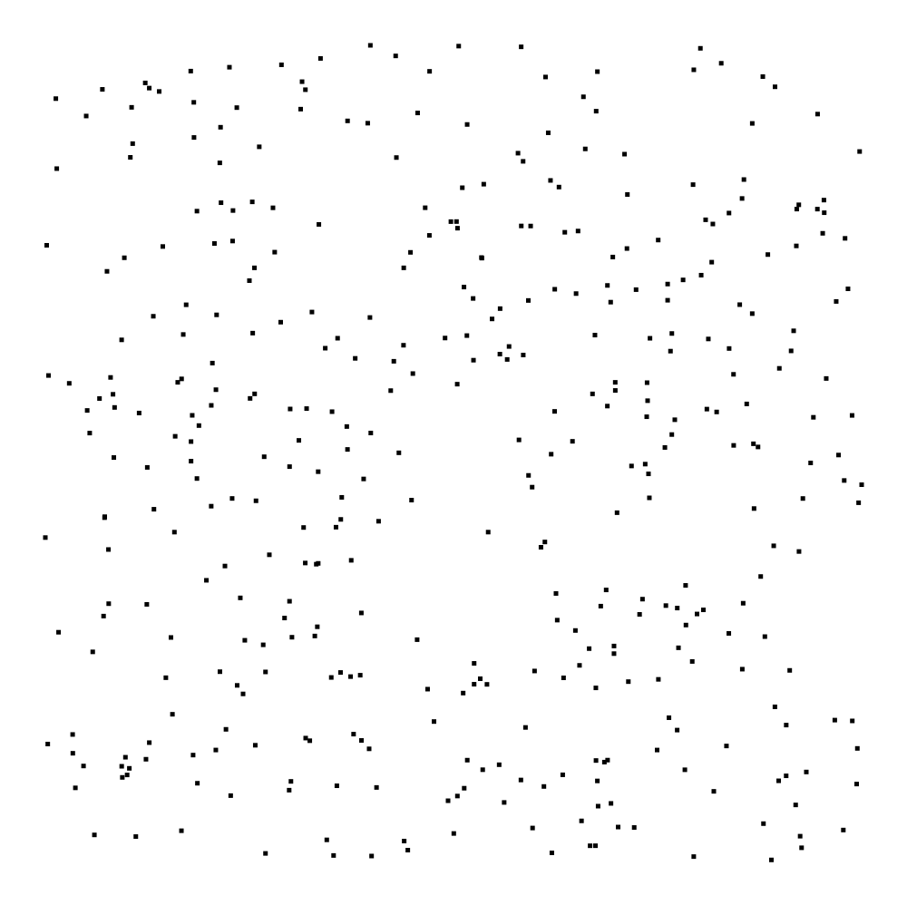
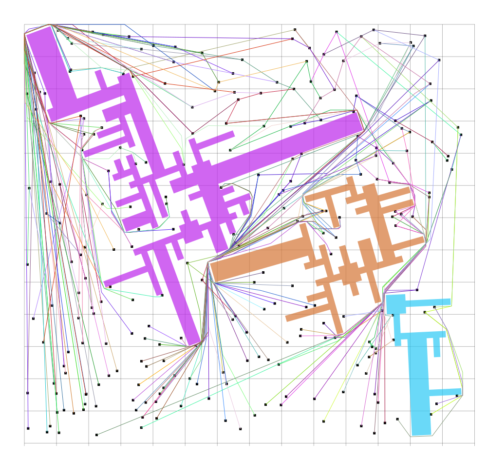

# Robot Motion planning + Freeze-Tag-Problem
We developed two solutions to the freeze-tag problem with obstacles in between.

## BEAUTIFUL PICTURES

## Node solution
Run all with `node index.js all`, run problems 2, 3, 13 with `node index.js [2,3,13]` (<-- don't use spaces in the array).
To visualize solutions in `solutions/best.mat`, run `node index.js manual`.
Commandline options for node:

`-i` when computing multiple solutions, it saves each solution immediately after it has been computed.
`-sp` save all the paths computed for each solution in pathproblem_number.json
`-p` import paths for solutions we are running.
`-v` also save the visualization of the solution after computing it (useful when debugging our freeze-tag algorithm and importing paths)

## Python solution
You can find the Python solution in `/solver`. By running `python solver.py`,
all solutions will be computed.
